

# `Heavens Door` 📝

## Rationale

> TODO add here

## Screenshot

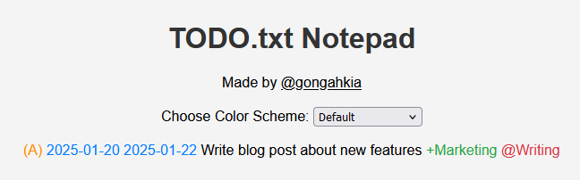

## Usage

> TODO add installation and usage instructions here

## Colorschemes

| Colorscheme | Example |
| :--- | :---: |
| Default | 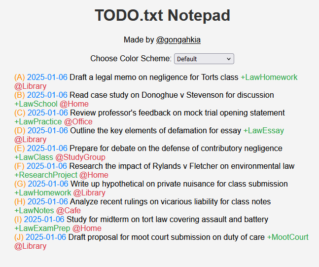 |
| Gruvbox | 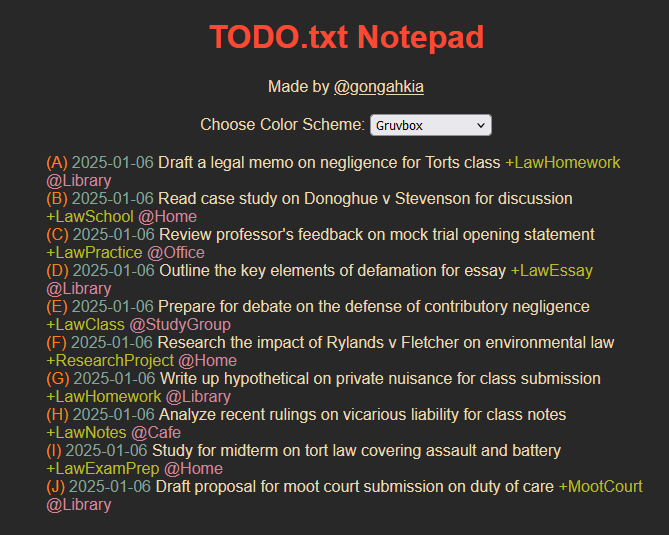 |
| Everforest | 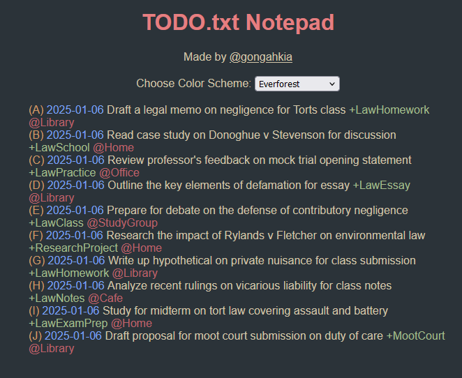 |
| Ayu | 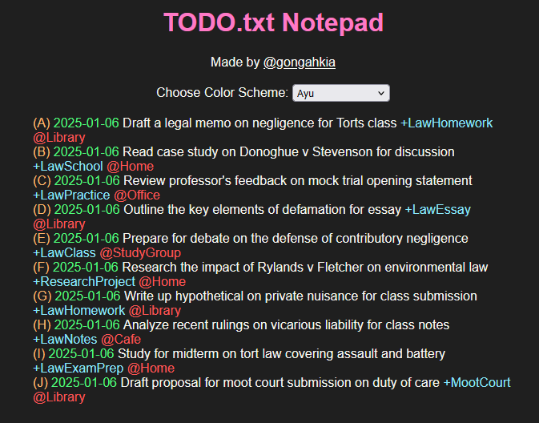 |
| Mononoki | 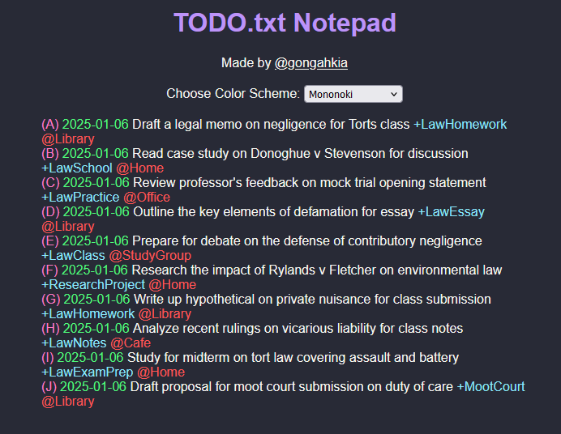 |
| Rose Pine | 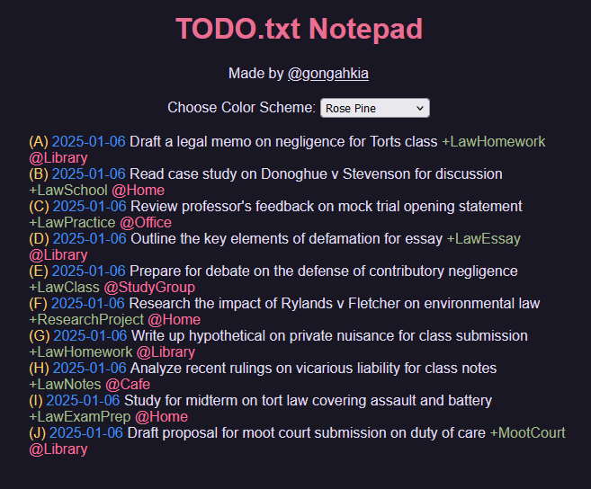 |
| Catpuccin | 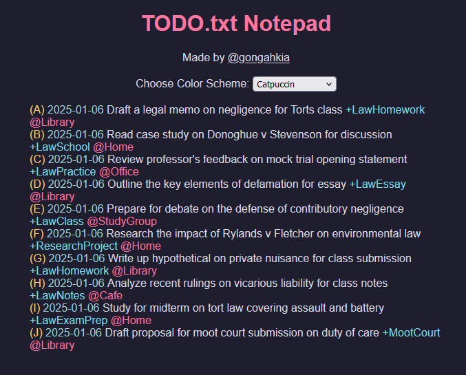 |
| Tokyo Night | 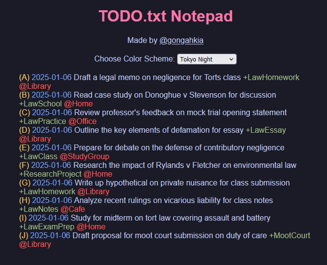 |
| Dracula | 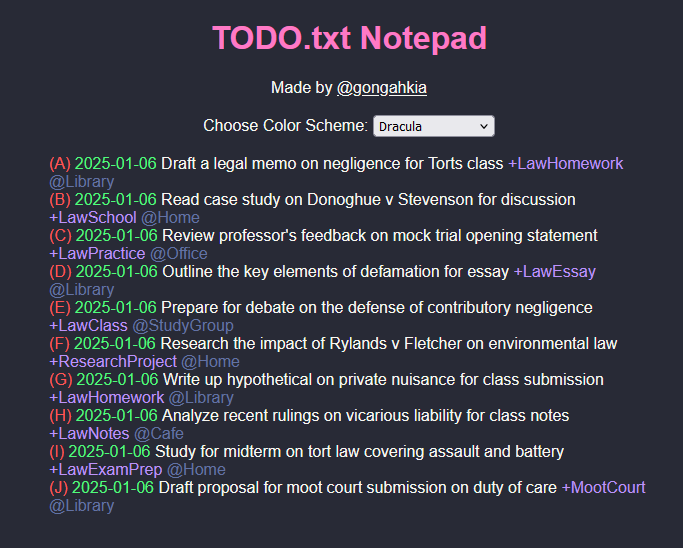 |
| One Candy Dark | 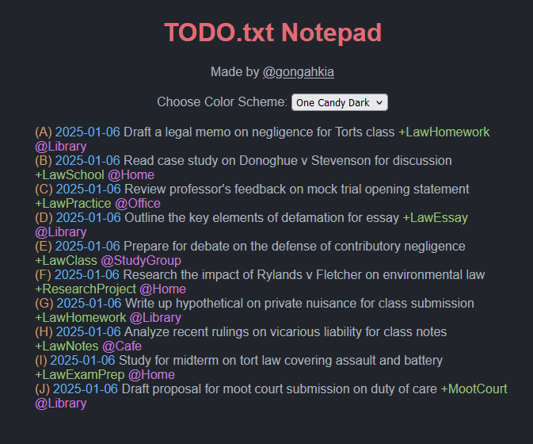 |
| Solarized | 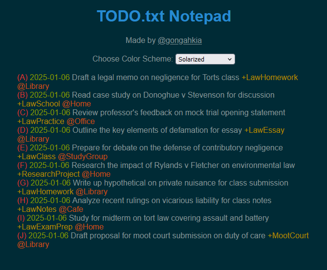 |
| Nord | 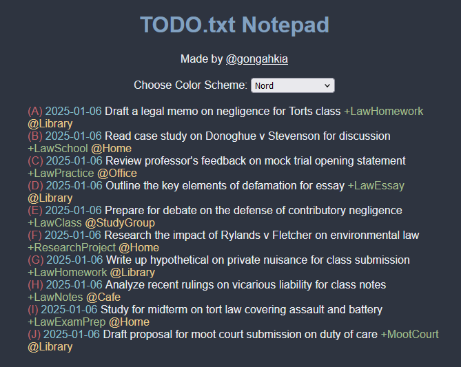 |

## Format

Heaven's Door adheres to the default `todo.txt` format specified [here](https://github.com/todotxt/todo.txt).  
  
Find out more at [todotxt.org](http://todotxt.org/).

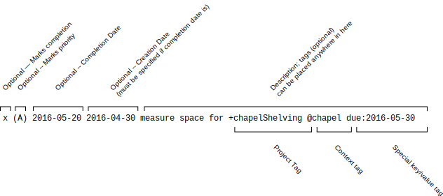

## Disclaimer

> TODO

## Reference

The name `Heavens Door` is in reference to [Heaven's Door](https://jojo.fandom.com/wiki/Heaven%27s_Door), [Rohan Kishibe's](https://jojo.fandom.com/wiki/Rohan_Kishibe) [stand](https://jojo.fandom.com/wiki/Stand) ability. [Heaven's door](https://jojo.fandom.com/wiki/Heaven%27s_Door) [first appears](https://www.reddit.com/r/StardustCrusaders/comments/xt5003/why_does_heavens_door_get_to_keep_its_name_while/) in [Diamond is Unbreakable](https://jojo.fandom.com/wiki/Stand), the fourth part of the [ongoing](https://www.reddit.com/r/StardustCrusaders/comments/15e13dg/is_jojos_bizarre_adventure_still_ongoing/?rdt=43328) manga series [JoJo's Bizarre Adventure](https://jojo.fandom.com/wiki/JoJo%27s_Bizarre_Adventure).

